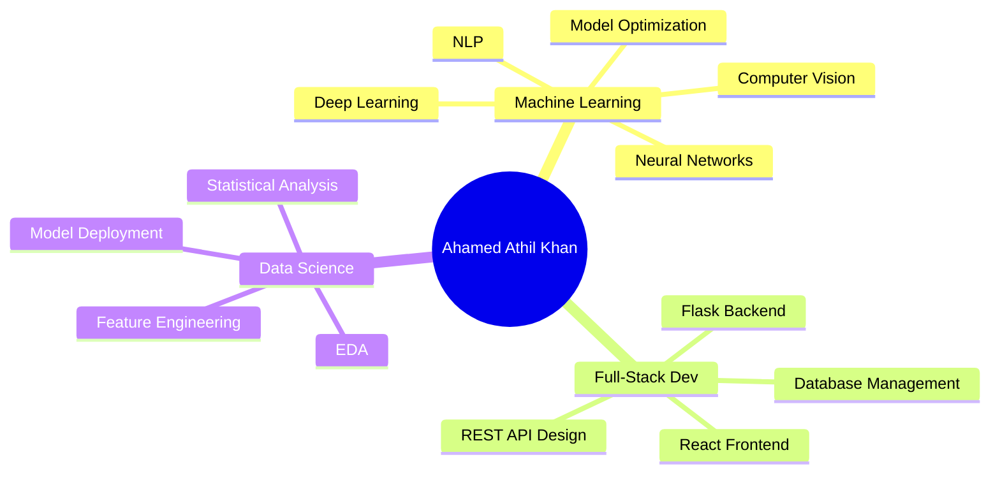

# Ahamed Athil Khan M V

<div align="center">

[](https://git.io/typing-svg)

[](https://github.com/iamathilkhan)
[](https://github.com/iamathilkhan)
[](https://linkedin.com/in/ahamed-athil-khan)

</div>

---

## 🎯 About Me

> **Passionate CS Student** specializing in **Machine Learning**, **Deep Learning**, and **Full-Stack Development**. Building production-grade AI systems with measurable impact.

🏆 **Proxy'24 National Hackathon Finalist** (Oct 2024) — Top 50 teams from 500+ entries  
🤖 **92% Face Recognition Accuracy** — SecurePay biometric authentication  
📊 **87% Prediction Accuracy** — Neptune ML disaster risk system  
🎓 **B.E. Computer Science** — NSCET, Tamil Nadu | Expected 2027  
📍 **Location:** Theni, Tamil Nadu, India

---

## 💻 Tech Arsenal

<div align="center">

### **Core Languages**


### **AI/ML Stack**


### **Web Development**


### **Database & Tools**


</div>

---

## 📊 GitHub Analytics

<div align="center">
  
  
</div>

<div align="center">
  
  
</div>

<div align="center">
  
</div>

---

## 🏆 Featured Projects

<table>
<tr>
<td width="50%">

### 🔐 [SecurePay](https://github.com/iamathilkhan/SecurePay)
**Multi-Modal Biometric Authentication Platform**

🎯 **92% Face Recognition Accuracy**  
⚡ Real-time biometric verification  
🔒 Secure payment integration  
🧠 TensorFlow + Flask + OpenCV

**Tech:** Python | Flask | TensorFlow | Face Recognition | SQLite

**Status:** 🚀 Production Development (43% Complete)

</td>
<td width="50%">

### 🌊 [Neptune](https://github.com/iamathilkhan/Neptune)
**ML Disaster Risk & Fishing Prediction System**

🎯 **87% Prediction Accuracy**  
⚡ <200ms response time  
🌍 Real-time risk zone mapping  
📊 Dual neural network architecture

**Tech:** Python | TensorFlow | Scikit-learn | Pandas

**Status:** 🎯 Deploying to Production

</td>
</tr>

<tr>
<td width="50%">

### 📚 [AI-Powered Study Planner](https://github.com/iamathilkhan/Study-Planner)
**Intelligent Academic Assistant**

🤖 **NLP-Powered AI Assistant**  
📅 Smart personalized scheduling  
📈 Real-time progress tracking  
💬 Interactive chat interface

**Tech:** Python | Flask | Transformers (PyTorch) | NLP

**Status:** 🚀 Active Development

</td>
<td width="50%">

### 📊 [KNN Purchase Predictor](https://github.com/iamathilkhan/KNN-purchase-predictor)
**Customer Behavior Classification**

🎯 **85-92% Accuracy**  
🔧 Optimized k-value selection  
🌐 Flask web interface  
📊 Feature scaling & normalization

**Tech:** Python | Scikit-Learn | Flask

**Status:** ✅ Deployed

</td>
</tr>

<tr>
<td width="50%">

### 🚢 [Titanic Survival Predictor](https://github.com/iamathilkhan/Titanic-Survival-Predictor)
**Binary Classification System**

✅ **82% Accuracy**  
🎯 7 engineered features  
📋 Complete EDA pipeline  
🧮 Logistic regression model

**Tech:** Python | Scikit-Learn | Pandas

**Status:** ✅ Completed

</td>
<td width="50%">

### 🏡 [USA Housing Price Predictor](https://github.com/iamathilkhan/House-price-predictor)
**Regression Analysis Web App**

📊 **R² = 0.91**  
💯 RMSE: ~$100K  
🎮 Interactive prediction UI  
📈 Linear regression model

**Tech:** Python | Flask | Scikit-Learn

**Status:** ✅ Deployed

</td>
</tr>
</table>

---

## 🎯 Key Achievements

<div align="center">

| 🏆 Achievement | 📅 Date | 📊 Impact |
|:---|:---:|:---|
| **Proxy'24 National Hackathon Finalist** | Oct 2024 | Top 50 teams from 500+ entries nationwide |
| **SecurePay 92% Accuracy** | Jul 2024 | Production-level face recognition system |
| **Neptune 87% Prediction Rate** | Aug 2024 | Deep learning disaster prediction deployed |
| **Litz Tech Internship** | Jul 2025 | Full-stack web development (15 days) |
| **12+ Active Repositories** | Ongoing | Continuous project development |

</div>

---

## 💼 Core Competencies

<div align="center">



</div>

<table align="center">
<tr>
<td align="center" width="33%">

**🤖 Machine Learning**
- Classification & Regression
- Neural Networks (ANN)
- Computer Vision (Face Recognition)
- Natural Language Processing
- Feature Engineering
- Model Evaluation & Tuning

</td>
<td align="center" width="33%">

**🌐 Full-Stack Development**
- Flask Backend Architecture
- React Frontend Development
- REST API Design
- Database Management (SQL)
- Responsive Web Design
- Deployment & DevOps

</td>
<td align="center" width="33%">

**📊 Data Science**
- Exploratory Data Analysis
- Data Preprocessing
- Statistical Modeling
- Predictive Analytics
- Model Deployment
- Production ML Systems

</td>
</tr>
</table>

---

## 🚀 Current Focus

<div align="center">

### **Immediate Goals (Nov 2025 - Jan 2026)**

🎯 Secure AI/ML or Web Dev **internship by December 2025**  
📱 Deploy **Neptune to production** (Real-time data integration)  
🔐 Complete **SecurePay frontend** + fraud detection module  
☁️ Learn **AWS/GCP cloud deployment**

### **Medium-term Goals (2026)**

🏢 Secure **full-time developer role** in AI/ML or Full-Stack  
🤖 Master **production ML deployment** & scalable architectures  
📖 Build technical content & **contribute to open-source**  
🎓 Complete **Machine Learning Specialization** certification

</div>

---

## 📈 Coding Activity

<div align="center">

<!--START_SECTION:waka-->


<!--END_SECTION:waka-->

</div>

---

## 🌐 Connect With Me

<div align="center">

[](https://linkedin.com/in/ahamed-athil-khan)
[](https://github.com/iamathilkhan)
[](mailto:athilkhan2005@gmail.com)
[](https://medium.com/@athilkhan2005)

📧 **Email:** athilkhan2005@gmail.com  
📱 **Phone:** +91 9042534731  
📍 **Location:** Theni, Tamil Nadu, India

</div>

---

## 📌 Latest Activity

<div align="center">

```diff
+ 🔄 Building Neptune deployment pipeline with real-time data integration
+ 🛠️ Developing SecurePay fraud detection module using anomaly detection
+ 📧 Actively applying for internships (AI/ML & Web Development roles)
+ 🤖 Implementing AI-Powered Study Planner with NLP assistant
+ 🌱 Next: Deploy Neptune live + contribute to open-source ML projects
```

</div>

---

<div align="center">

### 💡 **Fun Fact**

*"I build AI systems at night and break them in the morning — that's how I learn."* 🌙💻

---


---


</div>

---

<div align="center">

⭐ **If you found my work interesting, consider giving my repos a star!**  
💬 **Open to internships, collaboration, and learning opportunities**

**Last Updated:** November 17, 2025


</div>
